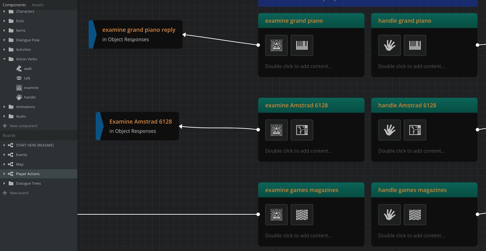
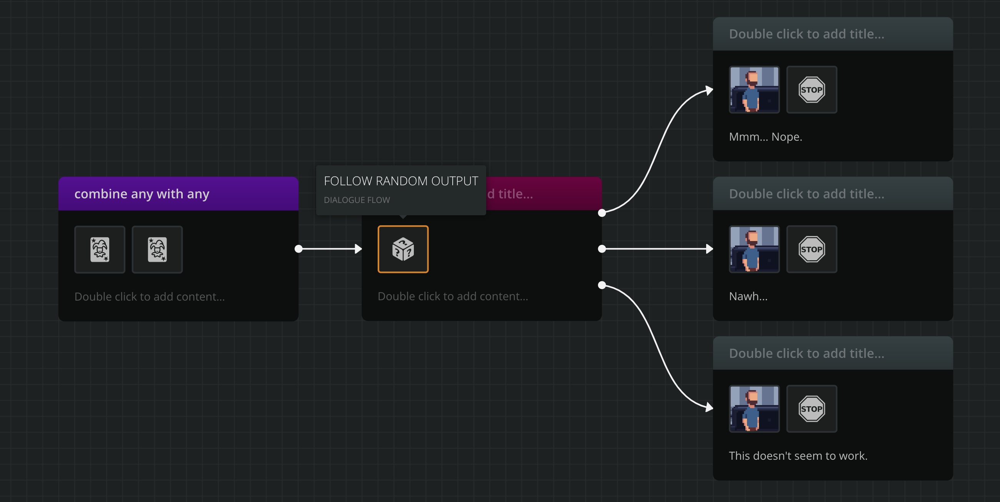

<!---Latest, Github.--->

# Regrets: an Arcweave-Godot Integration Demo

## Introduction

As a first example of integration between Arcweave and a game engine, we created *Regrets*, a short point and click adventure game using [Godot 3.5](https://godotengine.org/).

You can play the game on your browser, [here](https://arcweave.itch.io/regrets). 

We wrote the game's story and logic using Arcweave and used our own [Arcweave plugin for Godot](https://github.com/Arcweave/arcweave-godot-plugin) to pass the data to the game engine.

The Data of the game is already included in this repo. If you want to preview, edit or change the **Arcweave** project, you can import the backup file of this project [arcweave_project/regrets.arcw](arcweave_project/regrets.arcw), using our **Import Project** feature in your Arcweave [**Project List**](https://arcweave.com/app/list).

Moreover, we have created a couple of [YouTube video tutorials](https://www.youtube.com/watch?v=z4n4lu5ARa0) explaining the process.

This document gives a brief overview of the game's structure as a Godot project.

## Scenes

### Intro and Credits Screen

Upon running the game, the first thing that pops up is a simple introductory screen, offering the options to start a **New Game**, **Load**, read the **Credits**, and **Quit**.

Both **New Game** and **Load** change the current scene from `IntroCredits.tscn` to `Main.tscn`:

```gdscript
get_tree().change_scene("res://scenes_main/Main.tscn")
```

The difference is that **Load** also sets the singleton `LoadGame.load_game` to `true`. More on how loading works, under [Saving & Loading the Game](#saving--loading-the-game).

### Main Game

The game's **Main** scene (`Main.tscn`) is an Node2D with the script `main.gd` and runs pretty  much everything. It loads the current room, uses the data from the Arcweave plugin to check game conditions and run dialogues, deals with signals emitted by the various clickable objects, changes the game, UI, and dialogue states, makes the dialogue appear on the screen, plays audio, etc.

Its tree (somewhat simplified) has as follows:

```
Main (Node2D)
	Background Colour (ColorRect)
	UI (CanvasLayer)
		Children include: mouse menu,
		settings menu, cursor,
		audio players, tweens et al.
	Player (Node2D)
```

Various children have their own scripts defining their behaviours, like the [Player](#player) node.


### Player

Since no physics are involved in its movement, `Player.tscn` is a simple `Node2D`. In the point-and-click fashion, the game uses a path-finding routine to move the player node from its starting point to the position of the mouse click event. 

To achieve the player's movement, each `Location` scene includes a `Navigation2D` node and its required child `NavigationPolygonInstance`, to define the area the player can walk on. Each time `Main` loads a room, it stores its Navigation2D node in the variable `nav2D`:

```gdscript
func load_room_from_path(room_path : String, player_position : Vector2)-> void:
	...
	nav2D = $Location/Navigation2D
	...
```

(An optional `Line2D` node is also included in each `Location` scene for debugging purposes, but its visibility is turned off. Turn it on to see the path the player follows with each click.)

When the player clicks somewhere in the room, the Main node calls the current location's `Navigation2D` node and uses it to call its method `get_simple_path()`. Then, it assigns the returned value to the `Player` script's `path` variable:

```gdscript
func walk_player_to(a_position: Vector2):
	...
	var new_path = nav2D.get_simple_path(source_position, target_position)
	...
	player.path = new_path
	player.change_state(1) # WALK
```

Note that the above function also changes the player's state from `IDLE` (`0`) to `WALK` (`1`).

Upon these two assignments, the `Player` script starts its `_process(delta)` function (called upon the state change), plays the `WALK` sprite animation, and runs the path-finding routine for the new `path` value set by `Main`.

The path-finding happens by the `_process()` function calling the custom function `move_along_path()`.

Once the player walks along the whole path, the state changes back to `IDLE` and the `_process()` function stops.


### Locations

The game has 3 locations, represented by the scenes `Bedroom.tscn`, `PianoRoom.tscn`, and `Afterlife.tscn`. All three inherit from the scene `LocationClass.tscn` included in the same folder (`res://scenes_rooms/`)

The structure of `LocationClass.tscn` is as follows:

```
Location (Node2D)
	Art (Sprite)
	Line2D (Line2D)
	Navigation2D (Navigation2D)
		NavigationPolygonInstance (NavigationPolygonInstance)
	Objects (Node2D)
```

The `Art` is a `Sprite` of which the `Texture` is the background image of the location. It includes everything static, so no portable objects.

The `Line2D` and `Navigation2D` are used for the path-finding routine that moves the player around the room (see [Player](#player)).

The `Objects` node works as a parent for everything clickable in a room. (See [Clickable Objects](#clickable-objects), below.)

Note that the `Player` scene exists within the `Main` scene and not in the `Location` ones.

Also note that, in cases where objects must overlap the player sprite (like the piano, which the player can walk behind), their Z-index is set to `1`, instead of the default `0`.


### Clickable Objects

Each `Location` scene includes its own `ClickableObject` nodes, a superclass that extends `Area2D` and branches down to the classes `ClickableCharacter`, `ClickableItem`, and `ClickableExit`.

#### Mouse Behaviour

Depending on their class, mouse events produce slightly different behaviours:

* **Hover**: the mouse cursor changes to:
	* (for characters and items) its "hovering" form or
	* (for exits) its "walk out" form.

* **Click**:
	* (for characters and items) the mouse menu opens or
	* (for exits) the player approaches the exit and either walks through it (if unlocked) or delivers some relevant dialogue (if such dialogue exists).

#### Mouse Menu

Once opened, the mouse menu reveals 3 action buttons: **examine** (a magnifying glass), **handle** (a hand), and **talk to** (a mouth). 

Hovering over them produces the following effects:

* **Over "examine:"** the command line builds the sentence *Examine [the item/character just clicked].*
* **Over "handle:"** the command line builds the sentence:
	* (for characters) *Push [the character just clicked].*
	* (for portable items) *Take [the item just clicked].*
	* (for non-portable items) *Fiddle with [the item just clicked].*

To display the name of the object, we get the property `ClickableObject.object_name`, which is an export var and the Godot developer must fill in individually for each object.

The `portable` property is a flag `ClickableItems` have, which you can change by will:

```gdscript
export var portable : bool = true
```
Note that having `portable` does not mean the player will  be able to take the item, only that the command line will start with *Take...* Whether the player can actually add the item to the inventory depends on the Arcweave dialogue that gets triggered. (See [Inventory](#inventory).)

Clicking the action buttons triggers whatever dialogue is associated with the specific OBJECT + VERB combination, as described in [Dialogue](#dialogue).


### Objects' "State Variables"

The `ClickableObject` class includes a String export variable called `state_variable`. This is only needed  only used when dressing up a room with the items not yet taken by the player—see [Accessing Game Variables](#accessing-variables).

In a nutshell, this `state_variable`'s value should be the name of the story variable that refers to the specific item's state and begins with `i_` for "item." For example, for the Amstrad, it's `i_amstrad`. See [Adding & Removing Items](#adding--removing-items) for the enumerations of this convention and [Accessing Game Variables](#accessing-game-variables) for an example of use.


## Dialogue

### Starting Elements

A player action, e.g. **EXAMINE PIANO** points to a specific element in the Arcweave project, where the relevant dialogue is expected to begin.

To specify which element is the starting one for which dialogue, we have made sure every game object is represented by an Arcweave component (e.g. PIANO, ANDREAS, AMSTRAD, etc), organised in folders like **Characters**, **Items**, and **Exits**.

Moreover, there is a component for each player action (EXAMINE, HANDLE, TALK TO, and WALK—for exits) kept in the **Action Verbs** Components Folder, in the Arcweave project.

To catch the player actions, in the board **Player Actions**, we create elements with all needed compoment combinations as attachments, for example: [EXAMINE + PIANO], [EXAMINE + AMSTRAD], [HANDLE + AMSTRAD], et al. Those are the starting elements for the respective actions and point (through jumpers) to the respective dialogue trees (in other boards).



Note that the @-mentions in the elements' titles are meaningless. It is the attached components that the game engine searches for.

Therefore, when the player commands EXAMINE AMSTRAD, all the game has to do is iterate through those starting elements, to find the one that has the 2 specific attached components: EXAMINE and AMSTRAD. Using it as a starting element, it renders the correct dialogue that follows.

Note 1: we have put all the starting elements in the same **Player Actions** board, so you can optionally and easily optimise the iteration; instead of going through all the elements:

```
...
for element_id in story.elements:
	...
```

... you can iterate only through the ones in the specific board:

```
...
for element_id in player_actions_aw_board.elements:
	...
```

Note 2: the game is programmed to skip the starting element, follow its (unique) connection and render the next one. This is actually done by calling the function `render_options()` upon finding a dialogue's starting element. (See [Rendering Options](#rendering-options) for a brief description of how this function works.)

For more on the use of Components in this project, see [Using Components](#using-components).

### Rendering an Element

When the game finds a dialogue's starting element, it follows its unique connection and renders its target element, calling the function  `render_element(target_id)`. This function sets the `story`'s current element to the desired one.

```gdscript
func render_element(element_id ):
	set dialogue state to RENDERING_ELEMENT
	set current element of Story to the target
		using story.set_current_element(element_id)
	call render_current_element()
```

Here is some pseudocode showing the logic of the `render_element()` function:

```

func render_current_element():
	get current element from Story
	get its current content
	classify its components to categories:
		speakers
		items
		exits
		activities
		animations
		audios
		dialogue commands

	if there are any dialogue commands:
		execute them

	if current content is not empty:
		render it
		(this also executes any arcsript)
		(this sets the dialogue timer on)

	if there are any animations:
		play them (not implemented)

	if there are any audio components:
		play them one by one, in order of appearance

	if there are any activities
		run them

	if dialogue timer is stopped
		(that is, if content is empty):
		set it to 0.001
		start it
```

This function ends by setting the `DialogueTimer` node to either a tiny `0.001` (if the current element has not content) or the time needed to read the element's content. Therefore, one way or another, what happens next is up to the function that deals with `DialogueTimer`'s timeout.

For more on classifying components in this project, see [Component Types](#component-types).

### The Dialogue Timer

Once the `DialogueTimer` signals its timeout, this function is called:

```
func after_timer_do():

	if this was a pause because of a previous PAUSE component:
		render options
		return

	if we just rendered an element:
		reset the dialogue bubbles
		if there is a PAUSE element:
			set dialogue state to PAUSING
			set the dialogue timer to the PAUSE_TIME
			start it
			return

	if there is an EXIT activity component:
		exit the room from that exit	
		return

	if there is a STOP component:
		end the dialogue
		return

	(else) render options
```

Therefore, unless the dialogue ends (via a STOP component), an EXIT must happen, or a new PAUSE component appears, we get to the next part, which is rendering the current options.

### Rendering Options

Here is some pseudocode showing the logic of the `render_options()` function:

```
Render Options

	set the game state to DIALOGUE (if not already)
	set the dialogue state to RENDERING_OPTIONS

	get the current element's options
		(using story.get_current_options())

	if 0 options:
		end the dialogue
		return

	if 1 option:
		follow option right away
		return

	if there is a FOLLOW RANDOM OUTPUT component:
		pick a random output to follow
		return

	(else) create a button for each option
	if more than 3 options:
		show option navigation arrows
	set dialogue state to WAITING_CHOICE
```

Then, it's the player's move; picking one of the available options. And the dialogue continues.


### Rendering the Content

When `render_element()` calls `run_content()`, the latter makes a couple of checks to decide what must be done with the content:

```
func run_content():

	if there is an OVERLAP component:
		don't render content yet, but
		save it, to render it with next content
		return	

	(else) set dialogue state to RENDERING_ELEMENT
	
	if there is a TITLE component:
		ignore any SPEAKER components and
		render content as TITLE
		return

	(else) get speaker(s) node(s)
		from present CHARACTER components
	render content as speech

	if previous OVERLAP is saved:
		get speaker(s) node(s) & content
			from the saved speaker components
		render content as speech
```

Therefore, unless there is a TITLE or OVERLAP involved, the content gets rendered as speech, with the current element's CHARACTER(S) component(s) as the speaker(s).


### A Note on Logic

While creating this demo game, we wanted to give as much control to Arcweave as possible, not only regarding dialogue trees, but also game state and puzzle logic.

For example, when the player clicks on a **door** (a ClickableExit), the game checks the story state (saved in the `state_export.gd` file and read by the plugin), to determine whether the door is locked or not. If it is locked, the player doesn't enter, but delivers the appropriate dialogue describing the exit's locked condition.

Should the writer decide to have the exit unlocked, they only need to change things in the Arcweave project and re-export. Godot will pick it up from there and provide an unlocked exit for the player to walk through without issues.


## Using Components

In this project, we decided to demonstrate the flexibility of Arcweave's components, so we used them in two different ways:

1. to get the starting element of any dialogue and 
2. to pass metadata during an element's rendering.

### Getting the Starting Elements

This process is described above, under [Dialogue>Starting Elements](#starting-elements).

### Passing Metadata With Components

Besides the elements' content and arcscript's logic, there is also the need to transfer metadata that signal facts and calls game functions. For example:

* "the speaker of this line is Andreas"
* "this content must be displayed as a title"
* "the game ends here"
* "there is a short pause here"
* "play a sound effect here"
* "add this item to the inventory," etc.

We saw some of these cases in pseudocode, further up this documentation.

To pass metadata like the ones above, we use—once again—Arcweave's components. 


### Component Types

In Arcweave, we created components for everything we needed to express. To stay consistent and meaningful, we divided those components to specific types, so the game can tell what to do with each one.

All components have 2 attributes: "type" and "objectName." And here they all are:

#### Types & Object Names

* **character**:
	* **you**
	* **andreas**
* **item**: 
	* **notes**
	* **page**
	* **generic**: a wildcard for generic action-blocking replies.
	* **key**
	* **magazines**
	* **piano**
	* **gameScripts**
	* **amstrad**
* **exit**:
	* **finalExit**: the only exit involving logic.
* **dialogueFlow**:
	* **randomOut**: "follow a connection in random."
	* **overlapNext**: "overlap current content with the next one."
	* **stop**: "end the dialogue."
	* **pause**: "make a short pause."
	* **title**: "render current content as a title (not as character speech)."
* **activity**:
	* **exitThrough**: "exit through the exit the player has just clicked."
	* **endGame**: "end the game."
	* **inventoryAdd**: "add to the inventory the item the player has just clicked."
	* **inventoryRemove**: "remove from the inventory the item just clicked."
* **actionVerb**:
	* **walk**
	* **talk**
	* **examine**
	* **handle**
* **audio**:
	* **pianoTouch**: the sound played when you HANDLE + PIANO
	* **drumBreak**: the sound 
* **animation**:
	* **takePut**

The **generic** component is looked up in the project whenever a specific VERB + OBJECT or OBJECT + OBJECT reply is not available. This way, the writer does not have to provide separate replies for every object combination; only for the meaningful ones. For example, failing to get a specific reply for the player command USE AMSTRAD WITH PIANO, the game returns the generic action-blocking reply for USE GENERIC WITH GENERIC:  a random answer among *"Mmm... Nope,"* *"Nawh...,"* and *"This doesn't seem to work."*

To easily create random answers, in the "dialogueFlow" component type, we have included the "randomOut" component. Wherever present, it sends the flow to a random output (instead of producing option buttons):



Regarding the specific game's exits, since only the final exit ("finalExit") has logic, there is no need to create component for the other two ("exit to bedroom" and "exit to green room").

Finally, we also made an "animation" type, but didn't get around to using it. We decided to keep things simple regarding production and not bother with animating the player for anything other than walking.


## Inventory

Inventory items could have probably abided to the `ClickableObject` class but, due to bad planning, they were created first and have their own class: `Item`.

(The whole inventory system was created by following HeartBeast's tutorial [Resource Based Inventory](https://www.youtube.com/watch?v=rdUgf6r7w2Q) and it was one of the first things we did for the game. Had we designed it later, it would have probably been structured differently, but oh, well, it still works.)

One noteworthy thing is that clicking on an inventory item sets the UI state to HOLDING_ITEM and the cursor changes to the sprite of that item. Clicking on a second item triggers any relevant [OBJECT + OBJECT] dialogue.

Clicking on an inventory item should trigger the mouse menu to open but, again, we had to cut corners time-wise. One downside is that EXAMINING an inventory item is cryptic: the player must right-click on it. (Therefore, we had to put it in the player dialogue, as a hint.)

### Adding & Removing Items

Since Arcweave does not currently have an inventory system, we made the game's inventory work with a combination of state variables and two activity components: **inventoryAdd** and **inventoryRemove**.

On one hand, the story state variables are used for assignments and checks: *"player takes Amstrad 6128"* and *"does the player carry the Amstrad 6128?"* The first expression translates, in arcscript:

```
i_amstrad = 2
```

This is due to a couple of conventions:

1. the state of an item's existence is expressed through a variable that starts with `i_` (for "item") and the item's name. Therefore, the Amstrad has `i_amstrad`.
2. the possible states of an `i_` variable are:
	* **0**: the item is not yet in play. (E.g. the **key** starts out of play.)
	* **1**: the item is at its initial position. (E.g. the **Amstrad**.)
	* **2**: the item is in the player's inventory.
	* **3**: the item is used / gone.

On the other hand, the activity components tell the game to add or remove an item from the inventory window, without bothering consulting the state.

In the following screenshot, we see how the variable assignment happens in the same element with the **inventoryAdd** component:


Another solution would have been to have the game consult the story state (after rendering each element), compare it with the previous state, and do the inventory additions / removals accordingly, without the use of such components.


## State Handling

The story state is a dictionary containing all the arcweave variables used in the project. The plugin offers easy access to the story state via the methods `story.get_state()` and `story.set_state()`. 

### Saving & Loading the Game

For the **Save Game** functionality, we open a file to write the story state (using `story.get_state()`), as well as data like the current room, the player sprite's position, its facing direction, and the current inventory.

To **Load** we do the reverse: check if a save file exists, open it, and read the necessary data.

As mentioned under [Intro and Credits Screen](#intro-and-credits-screen), when we click "Load" at the Intro Screen or the Settings Menu, we essentially **Restart** the game, after setting the singleton `LoadGame.load_game` to `true`. Upon loading the Main scene, this singleton's value is checked and the `load_saved_game()` function gets called accordingly.

### Accessing Game Variables

In some cases, we need to directly access story variables. Again, we do this by calling `story.get_state()` and specifying the story variable we need to call.

For example, each time the player enters a room, the game calls the function `dress_up_room(room_node)` and iterates through the room's objects (children of the "Objects" node, as mentioned under [Locations](#locations)), to check which ones are present, according to the story state.

This check is performed by looking up, in the story state, the value of the object's `state_variable`. (See ) If the value is `1` (according to the conventions mentioned under [Adding & Removing Items](#adding--removing-items), the item should be visible and monitorable (as an Area2D) in the location.

## Conclusion

We kept this README file as short as possible, to explain just the basics of our demo game. If any part is not clear, do not hesitate to contact us on [Discord](https://discord.com/invite/atVXxAK). 
